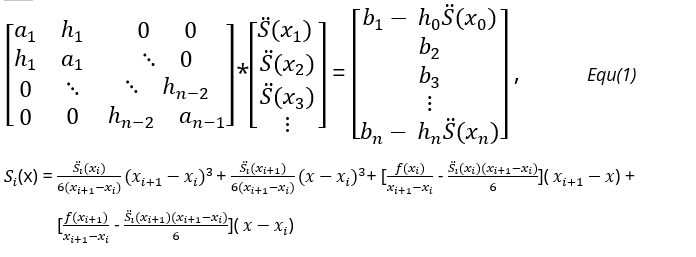

# CubicSpline
Cubic Spline Function in MATLAB

You can use this function to create a cubic spline graph. It works in all dimensions. You just need three parameters: "value", you need to create an array which stores the output data points that you want to fit; "time" it's basically the time variable, but you can use some other variable instead of it; "number_of_data", it tells you how many data points that you have in order to create this graph. Thats is for using this function, enjoy it!

# QUICK OVERVİEW ABOUT ALGORITHM BEHIND IT
When I build this code, I have used the algorithm that is given in the course which is:

